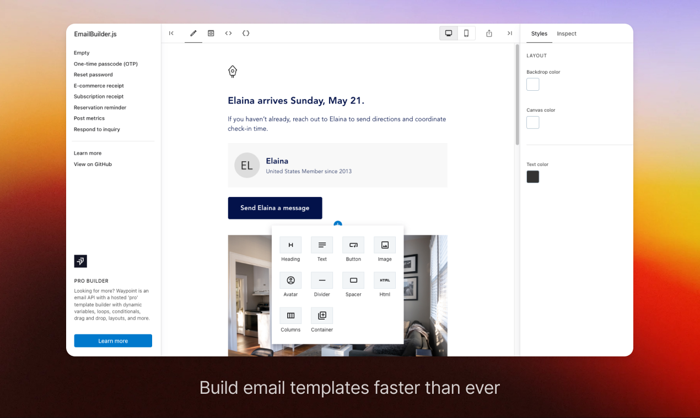
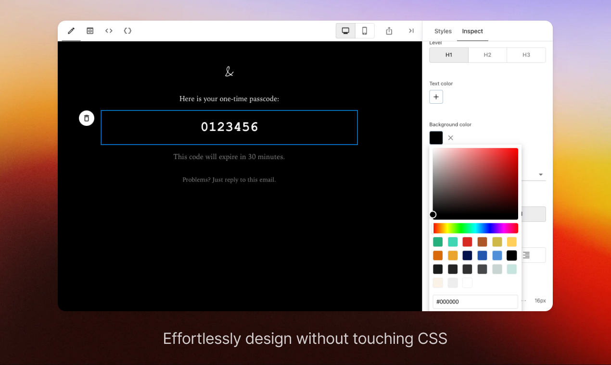
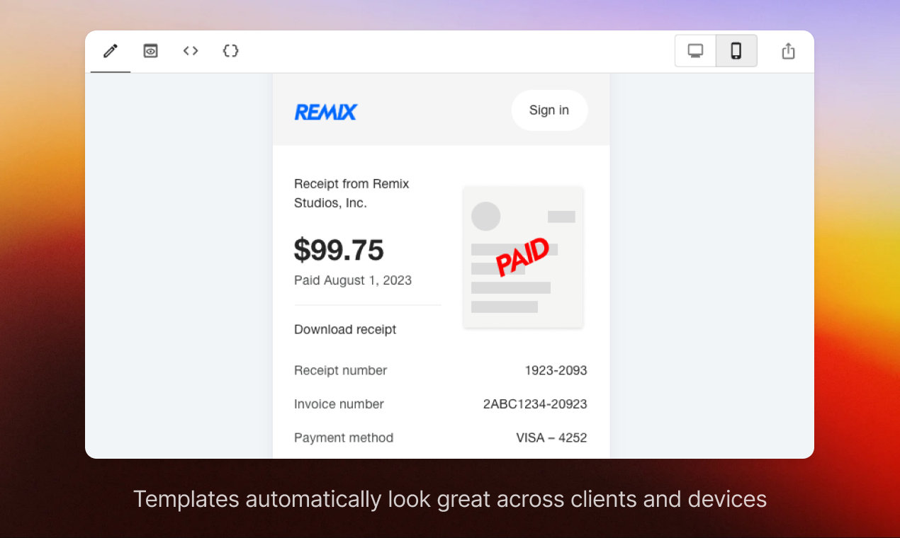

<div align="center">
  <h1>Craftify Builder</h1>
  <p align="center">
    <a href="#">Demo / Playground</a>&emsp;&middot;&emsp;
    <a href="#">Scoppy9201.com</a>&emsp;&middot;&emsp;
    <a href="https://github.com/scoppy9201/Craftify">GitHub</a>
  </p>
</div>

## Introduction

Craftify Builder is a free and open-source UI builder for developers. Build interfaces faster than ever with clean JSON or HTML output that works seamlessly across platforms and devices.





<br>

## Build simple layouts to complex systems

Use a no-code builder that is flexible enough to create a wide variety of designs – from simple layouts to complex systems.


<br>

## Why?

It's time to move beyond outdated UI building approaches.

Craftify Builder provides a modern solution with:

* Drag & drop builder
* Component-based architecture
* Clean JSON structure

This allows both developers and non-technical users to build faster and collaborate better.

<br>

## Built-in blocks

Each block is modular and extendable:

* Text
* Input
* Button
* Container
* Divider
* Heading
* Image
* Spacer
* Custom block

<br>

## Platform support

All blocks are optimized for:

* Desktop
* Mobile
* Tablet



---

## Builder Output

Craftify Builder can export:

* JSON structure
* HTML output
* API-ready data

<div align="center">
  
  
</div>

<br>

## Using Craftify Builder

Install the package:

```bash
npm install craftify-builder
```

Example configuration:

```javascript
const CONFIGURATION = {
  root: {
    type: 'Layout',
    children: ['block-1'],
  },
  'block-1': {
    type: 'Text',
    content: 'Hello Craftify ',
  },
};
```

Render:

```javascript
import { render } from 'craftify-builder';

const html = render(CONFIGURATION);
```

---

## Self hosting

```bash
git clone https://github.com/scoppy9201/Craftify.git
cd FormKit
npm install
npm run dev
```

---

## Contributing

Feel free to fork and submit pull requests.

---

## License

AGPLv3 License.

---

<div align="center">
  Made with ❤️ by Craftify
</div>
